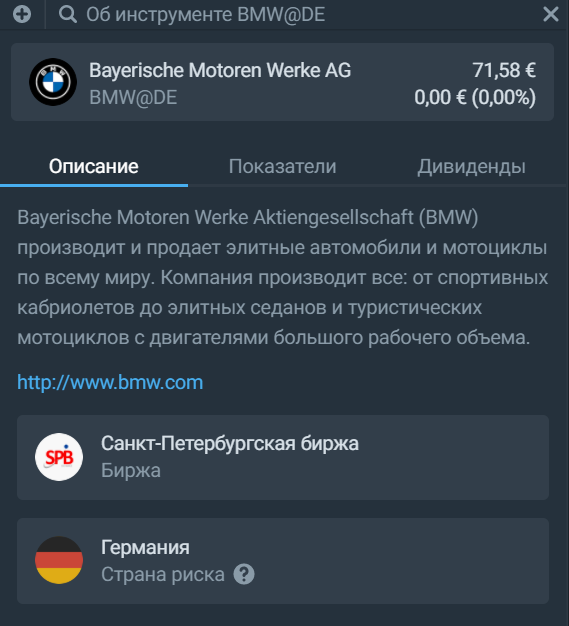
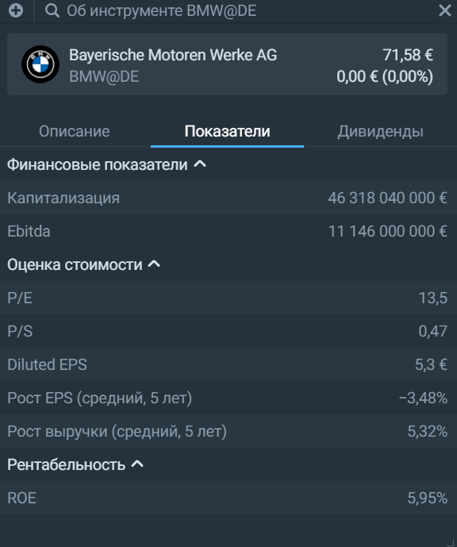
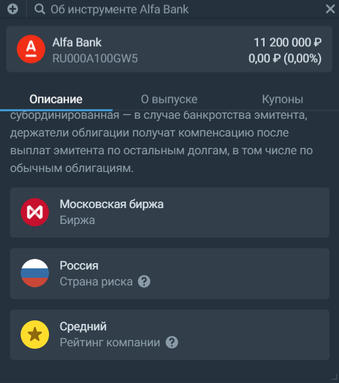

## Об инструменте 
В виджете собрана основная информация по выбранному инструменту. Каждый класс активов имеет своё уникальное содержание виджета "Об инструменте". 
### Для акций 
Во вкладке "Описание" можно найти краткий рассказ о бизнесе компании, посмотреть её сайт, узнать основную страну деятельности и биржу, на которой обращаются бумаги: 

Вкладка "Показатели" описывает положение дел в компании с точки зрения цифр. Здесь раскрываются финансовые показатели, мультипликаторы и данные о динамике акций: 

Чтобы увидеть всю информацию, потяните мышкой за полосу прокрутки в правой части. При этом на диаграммах "Выручка и прибыль" и "Денежные средства" в самом низу вкладки можно выбрать отображение по кварталам или по годам: 

Во вкладке "Дивиденды" собран список выплат компании акционерам, а их дохнодность указывается в процентах от стоимости ценной бумаги на момент выплаты.

### Для облигаций 
По облигациям можно посмотреть информацию об эмитенте, параметры выпуска и график выплаты купонов. 

Во вкладке "Описание" можно найти краткий рассказ об эмитенте, посмотреть его сайт, узнать оценку кредитоспобности, основную страну деятельности и биржу, на которой обращаются бумаги:

Вкладка "О выпуске" отображает основные параметры облигации: 

Во вкладке "Купоны" собрана информация о выплатах по облигации. Наглядное отображение прошлых и будущих купонов представлено на специальном треке "Выплачено купонов":

