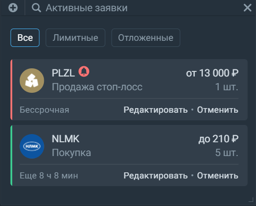

# Активные заявки 
В этом виджете можно посмотреть свои активные заявки по всем бумагам и отменить их, если нужно: 

Кроме этого, заявки можно отредактировать не переключаясь на другие виджеты: 

Обратите внимание, что в режиме редактирования ваша заявка останется активной до того, как вы нажмёте на кнопку "сохранить": 

