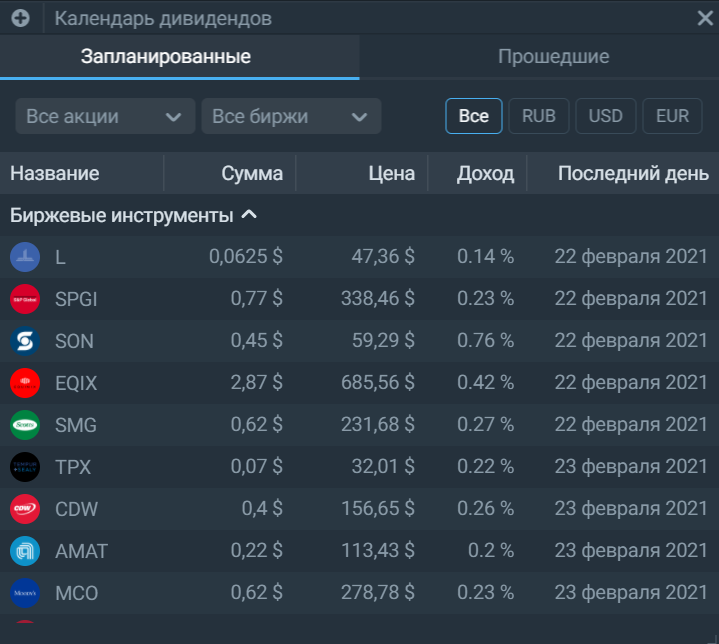

# Календарь дивидендов
Виджет позволяет посмотреть все намечающиеся и прошедшие дивидендные выплаты. В форме таблицы собраные такие данные, как название инструмента, сумма дивиденда, текущая цена, доход от выплаты в процентах и последний день, когда можно купить бумагу для попадания в реестр акционеров:  

Содержимое календаря можно настроить с помощью фильтров:  

Во-первых, выбрать для отображения не все акции, а только те, что находятся портфеле или в избранном. 
Во-вторых, выбрать для отображения бумаги, торгующиеся на конкретной бирже: Московской или Санкт-Петербургской. 
В-третьих, выбрать для отображения инструменты, номинированные в конкретной валюте: рублях, долларах или евро.  
