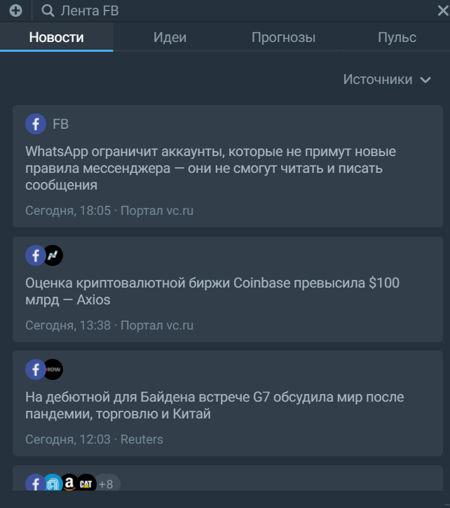
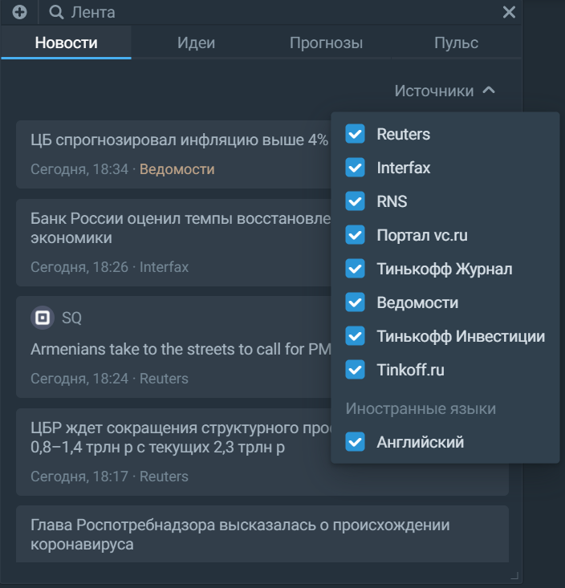
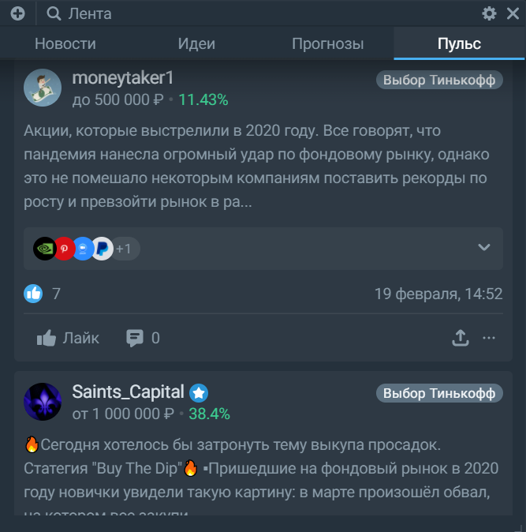
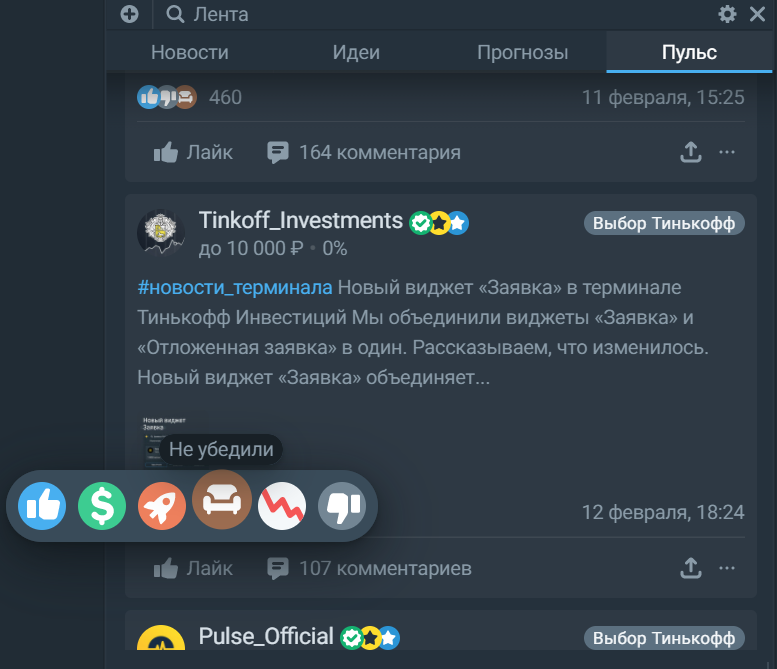

# Лента 
Виджет агрегирует различную информацию о рынке в 4 разных вкладках: Новости, Идеи, Прогнозы, Пульс. Ленту можно настроить на отображение информации по конкретной компании. 

Для этого нажмите на строку поиска со значком лупы или воспользуйтесь группами. Чтобы сбросить фиксацию виджета на конкретном инструменте, нажмите ещё раз на строку поиска и отмените свой выбор. 

Во вкладке новости вы можете настроить пул источников: 

Также в виджете "Лента" доступна вкладка с социальной сетью "Пульс" — в ней можно делиться своим мнением и читать других авторов: 

Попробуйте оставить комментарий или оцените пост лайком. Или дизлайком — в виджете доступны 6 видов реакций на все случаи жизни: 

Во вкладке "Пульс" есть возможность фильтрации контента: только посты, только сделки или же посты и сделки вместе. Если виджет закреплён за конкретным инструментом, то можно оставить отображение только популярных постов. 
 
