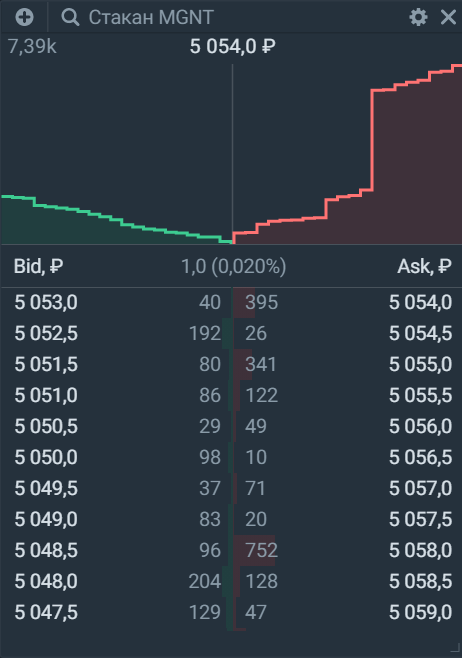

## Стакан 
Биржевой стакан отображает список лимитных заявок на покупку (Bid) или продажу (Ask) актива: 

Чтобы выставить заявку, нажмите на цену, по которой хотите выставить лимитную заявку. Нажав на строку, вы откроете виджет «Заявка», в котором отобразится лимитная заявка по той цене, на которую вы нажали. 

В настройках вы можете изменить тип отображения стакана, его глубину, а также включить или выключить такие функции, как глубина рынка, спред, нарастающий объём или доходность облигаций: 

### Тип отображения  
3 способа отображения биржевого стакана:
1. Компактный 
2. Классический, 1 колонка 
3. Классический, 2 колонки 

### Глубина
Этот параметр позволяет отобразить в стакане нужное количество лучших цен, по которым есть заявки как на покупку, так и продажу. Минимальная глубина составляет 10, максимальная — 50.

### Глубина рынка
Нажмите, чтобы включить или выключить график глубины рынка, который визуализирует баланс предложений на покупку и продажу. Чем выше параметр «Глубина», тем больше цен и привязанных к ним заявок отобразится на графике. 
Передвижение курсора по графику позволяет увидеть цену и нарастающий объём заявок. Нажав на график, можно открыть виджет «Заявка», в котором отобразится цена, на которую вы нажали. 

### Спред
Демонстрирует разницу между лучшей ценой на покупку и продажу. Как правило, чем меньше ликвидность инструмента, тем больше спред. 

### Нарастающий объём 

