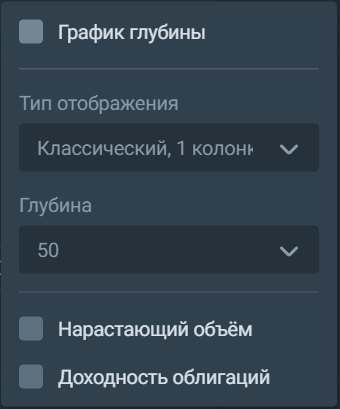
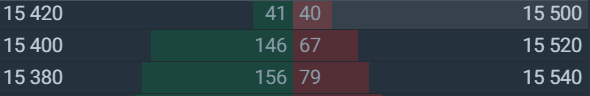

## Стакан 
Биржевой стакан отображает список лимитных заявок на покупку (Bid) или продажу (Ask) актива: 

Каждая строка стакана демонстрирует, сколько лотов актива собираются купить или продать участники торгов по данной цене. 
Чтобы выставить заявку, нажмите на строку с ценой. После этого откроется виджет «Заявка», в котором отобразится лимитная заявка по той цене, на которую вы нажали. 

В настройках вы можете изменить тип отображения стакана, его глубину, а также включить или выключить такие функции, как глубина рынка, спред, нарастающий объём или доходность облигаций: 

### Тип отображения  
3 способа отображения биржевого стакана:
1. Компактный 
2. Классический, 1 колонка 
3. Классический, 2 колонки 

### Глубина
Этот параметр позволяет отобразить в стакане нужное количество лучших цен, по которым есть заявки как на покупку, так и на продажу. Минимальная глубина составляет 10, максимальная — 50.

### Глубина рынка
Нажмите, чтобы включить или выключить график глубины рынка, который визуализирует баланс предложений на покупку и продажу. Чем выше параметр «Глубина», тем больше цен и привязанных к ним заявок отобразится на графике. 
Передвижение курсора по графику позволяет увидеть цену и нарастающий объём заявок. Нажав на график, можно открыть виджет «Заявка», в котором отобразится цена, на которую вы нажали. 
Цифра в левом верхнем углу графика показывает суммарное предложение доминирующей стороны торгов. Если в стакане лотов на продажу выставлено больше, чем на покупку, то данная цифра отобразит именно суммарное предложение продавцов. 

### Спред
Демонстрирует разницу между лучшей ценой на покупку и на продажу. Как правило, чем меньше ликвидность инструмента, тем больше спред. 

### Нарастающий объём 
Этот параметр позволяет отображать в строке цены стакана суммарный объём предложения и спроса: в каждой строке показано количество выставленных по данной цене лотов с учётом суммы всех предыдущих строк. Нарастающий объём позволяет оценить способность текущего баланса спроса и предложения удовлетворить вашу рыночную заявку. Например, вы хотите купить по рынку 150 лотов данной бумаги: 

 

Как мы видим, 40 бумаг будут куплены по цене 15500, 67 акций получится приобрести по цене 15520, а остаток заявки исполнится по 15540. 
