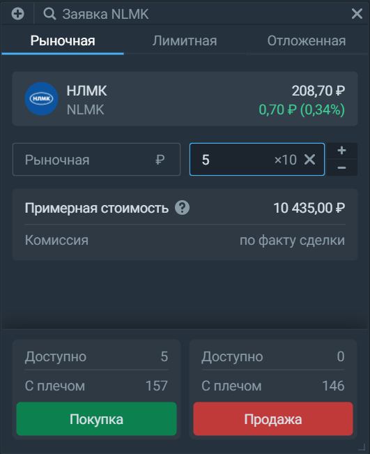
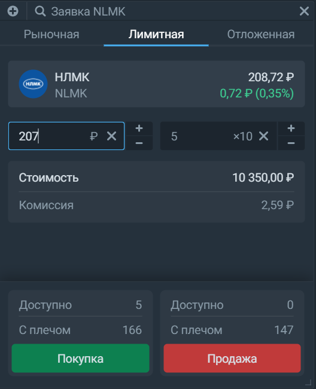
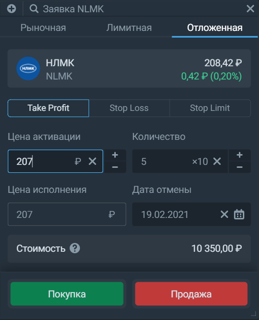

# Заявки
Виджет позволяет отдать приказ брокеру на покупку или продажу какого-либо актива. В зависимости от своих целей, вы можете выбрать использовать несколько различных типов заявок. Таким образом, чтобы полностью разобраться в работе виджета, необходимо чёткое понимание того, какие бывают заявки. Заявки бывают биржевые и отложенные. Биржевые заявки мгновенно отправляются брокером, как ни странно, на биржу. Они бывают двух типов: лимитная и рыночная. Отложенные заявки хранятся на сервере брокера до выполнения определённых условий. В Тинькофф.Инвестиции есть три типа таких заявок: Stop Loss, Take Profit, Stop Limit. 

## Рыночная заявка
Это заявка, у которой есть лишь один параметр - количество лотов. В рыночных заявках нет определённой цены, так как вы поручаете брокеру провести сделку на тех условиях, которые сложились на рынке в данный момент времени. То есть цена исполнения такой заявки и, как следствие, размер комиссии заранее неизвестны ни вам, ни брокеру. Рыночные заявки имеют срок жизни IoC (Immediate or canceled), что обозначает "Выполнить сразу или отменить", то есть заявки выставляются на биржу и исполняются полностью или частично, после чего отменяются биржей. 

## Лимитная заявка
В отличие от рыночных, у лимитных заявок есть цена, которую вы устанавливаете сами, поэтому брокер знает стоимость такой заявки и сразу отображает вам комиссию, которую вы заплатите в случае полного исполнения. Срок жизни лимитной заявки - до конца торговой сессии, то есть лимитная заявка выставляется на биржу и остается в биржевом стакане до окончания торговой сессии или до полного исполнения всего объёма заявки. 

## Отложенная заявка
Отложенная заявка конвертируется в биржевую при достижении определенного условия. Сейчас такое условие одно: достижение инструментом определенной цены. Разные отложенные заявки порождают разные биржевые заявки:
- Stop Loss порождает рыночную заявку
- Take Profit порождает лимитную заявку
- Stop Limit порождает лимитную заявку

Stop Loss в мобильном приложении - это Stop Limit. В мобильном приложении можно выставить стоп-заявки только на продажу, в терминале же вы также можете выставить стоп-заявки на покупку.

В терминале вы можете выставить 6 видов отложенных заявок - 3 типа заявок и каждую из них можно установить на покупку и на продажу:

1. Stop Loss на покупку можно выставить выше текущей цены. Его нужно использовать для:
• закрытия шорта с фиксацией убытка
• входа в лонг в последующие дни по цене выше текущей

2. Stop Loss на продажу можно выставить ниже текущей цены. Его нужно использовать для:
• фиксации убытка в лонге
• входа в шорт на определенном уровне в последующие дни

3. Take Profit на покупку можно выставить ниже текущей цены. Его нужно использовать для:
• закрытия шорта с фиксацией прибыли
• входа в лонг в последующие дни по цене меньше текущей

4. Take Profit на продажу можно выставить выше текущей цены. Его нужно использовать для:
• фиксации прибыли по лонгу
• входа в шорт на определенном уровне в последующие дни

5. Stop Limit на покупку можно выставить выше текущей цены. Его нужно использовать для:
• закрытия шорта с фиксацией убытка
• входа в лонг в последующие дни по цене больше текущей

6. Stop Limit на продажу можно выставить ниже текущей цены. Его нужно использовать для:
• закрытия лонга с фиксацией убытка
• входа в шорт по цене ниже текущей в последующие дни
