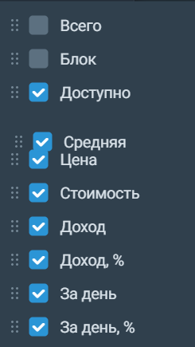

# Портфель 
В виджете «Портфель» можно посмотреть стоимость позиции, среднюю цену одного лота и проверить, сколько денег или бумаг заблокировано в портфеле для исполнения заявок. 

С помощью значка шестерёнки в правом верхнем углу можно открыть настройки, чтобы добавить или убрать столбцы с параметрами. Также столбцы можно перемещать — для этого в настройках зажмите мышкой название столбца и перетяните его на нужную позицию: 

Из "Портфеля" можно открыть другие виджеты. Чтобы открыть "Пополнение/Вывод" и "Операции", нажмите на название счёта в левом верхнем углу. Чтобы открыть "Маржинальную торговлю", нажмите на надпись под названием счёта. Кроме этого, щёлкнув правой кнопкой по инструменту в портфеле, вы сможете открыть целый ряд виджетов, которые будут сразу привязаны к этому интрументу. 
