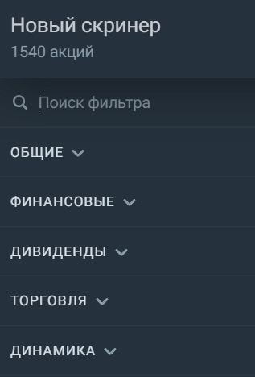

# Скринер 
Виджет позволяет использовать фильтры для сортировки всего многообразия доступных ценных бумаг. Отбирать акции можно более чем по 35 критериям. Например, по финансовым показателям, дивидендным выплатам, капитализации, EPS, объёму торгов или консенсус-прогнозу аналитиков. Вы можете найти нужный фильтр в строке поиска: 

 

Вы можете выбрать готовый скринер из списка или создать свой собственный, а затем сохранить подобранный набор фильтров: 

 
