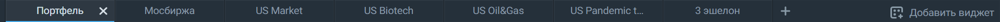

## Вкладки
Сразу под верхней панелью располагается панель вкладок: 
 

Каждая вкладка — это отдельное рабочее пространство, которое вы можете использовать для торговли, наблюдения за рынками и собственным портфелем. Чтобы создать новую вкладку, нажмите на иконку    справа от уже открытых вкладок. Количество вкладок в терминале не ограничено.  

Открытые вкладки можно переместить, переименовать, дублировать или удалить. 
Чтобы переместить вкладку, ее нужно потянуть мышкой и переставить, а чтобы переименовать — щёлкнуть левой кнопкой мыши по текущему названию, ввести новое и нажать Enter:

Создать дубликат вкладки можно нажатием правой кнопкой мыши, а для удаления достаточно щёлкнуть по крестику: 

Обратите внимание, что восстановить содержание вкладки после удаления будет невозможно: 
 
