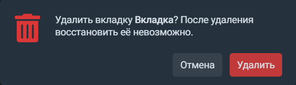

## Вкладки
Сразу под верхней панелью располагается панель вкладок: 
 

Каждая вкладка — это отдельное рабочее пространство, которое вы можете использовать для торговли, наблюдения за рынками и собственным портфелем. Чтобы создать новую вкладку, нажмите на иконку    справа от уже открытых вкладок. Ограничений на количество открытых в терминале вкладок нет.  

Открытые вкладки можно переместить, переименовать, дублировать или удалить. 
Чтобы переместить вкладку, её нужно потянуть мышкой и переставить, а чтобы переименовать — щёлкнуть левой кнопкой мыши по текущему названию, ввести новое и нажать Enter.

Создать дубликат вкладки можно щёлкнув по ней правой кнопкой мыши, а для удаления достаточно нажать на крестик. Обратите внимание, что восстановить содержание вкладки после удаления будет невозможно: 

 
Также на панели вкладок находится кнопка "Добавить виджет". С её помощью вы можете заполнить рабочее пространство различными функциональными элементами. 
