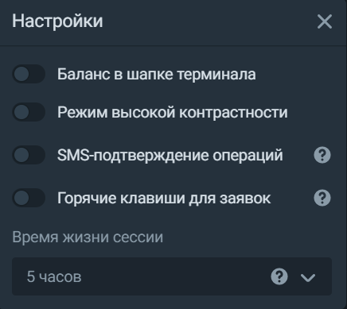

# Верхняя панель
Если у вас открыт ИИС, на этой панели можно выбрать, с какого счёта вы будете торговать сейчас:

 

Здесь вы также можете открыть настройки или выйти из терминала: 

## Настройки
В этой вкладке можно включить отображение баланса на верхней панели, изменить контрастность терминала, отключить подтверждение сделок по СМС, включить горячие клавиши для заявок и настроить время сессии так, чтобы не приходилось заново логиниться после каждого перерыва в работе:

