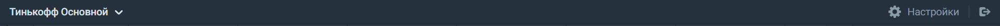
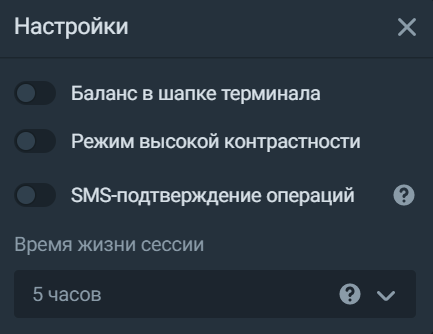

# Верхняя панель
**Если у вас открыт ИИС, на этой панели можно выбрать, с какого счёта вы будете торговать сейчас:**

 

**Здесь вы также можете открыть настройки или выйти из терминала:** 

## Настройки
**В этой вкладке можно отключить подтверждение сделок по СМС и настроить время сессии так, чтобы не приходилось заново логиниться в терминале после каждого
перерыва в работе:**

