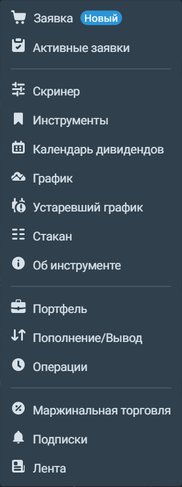
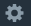

## Виджеты 
Виджеты — это элементы, из которых состоит терминал. Каждый виджет отражает один из параметров инструмента или вашего портфеля: график торгов, стакан предложений на покупку и продажу, ввод и вывод средств и т. д. Всего в терминале 15 виджетов:

Любой виджет можно переместить по экрану, зажав его левой кнопкой мыши, а также изменить в размерах, потянув за правый нижний угол виджета. Большинство виджетов можно настроить с помощью значка шестерёнки в правом верхнем углу: 

Привязать виджет к какому-либо активу можно через строку поиска со значком лупы:  Чтобы привязать несколько виджетов к одному активу, их можно связать в группы. Группы обозначены цветными кружками в левом верхнем углу виджета. Чтобы привязать виджет к уже существующей группе или создат новую, нажмите на кружок с крестиком  и выберите группу, к которой хотите его привязать. Кроме того, если в каком-либо виджете присутствует название актива, вы можете щёлкнуть по нему правой кнопкой мыши и нажать "привязать все виджеты". 
